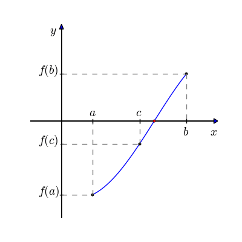

# Recursão

Recursão é quando uma função chama ela mesma, geralmente com um argumento diferente ou com um estado diferente. Isso é usado para resolver problemas que podem ser divididos em problemas menores do mesmo tipo. O método da bisseção é um exemplo de um algoritmo que pode ser implementado usando recursão para encontrar raízes de funções. Ele é um método de busca iterativa para encontrar raízes de funções que funciona dividindo o intervalo de busca ao meio, verificando em qual metade a raiz está e continuando a busca nessa metade até que a precisão desejada seja atingida.

<div align="center">




</div>

O código em Haskell abaixo usa recursão para implementar o método da bisseção, que é usado para encontrar raízes de funções.

```haskell
bisect :: (Float -> Float) -> (Float, Float) -> Float -> Float
bisect f (a,b) epsilon
    | abs (b - a) < epsilon = (a + b) / 2
    | f ((a + b) / 2) == 0 = (a + b) / 2
    | f (a) * f ((a + b) / 2) < 0 = bisect f (a, (a + b) / 2) epsilon
    | otherwise = bisect f ((a + b) / 2, b) epsilon

f :: Float -> Float
f x = x^2 - 2

main :: IO ()
main = do
    print $ bisect f (0, 100) 0.000001
    -- Output: 1.4142138
```

A função  _bisect_ é a função recursiva principal. Ela tem três argumentos: uma função _f_, um par de números reais _(a, b)_ que representa o intervalo onde a raiz deve ser procurada, e uma precisão _epsilon_.

```haskell
bisect :: (Float -> Float) -> (Float, Float) -> Float -> Float
bisect f (a,b) epsilon
    | abs (b - a) < epsilon = (a + b) / 2
    | f ((a + b) / 2) == 0 = (a + b) / 2
    | f (a) * f ((a + b) / 2) < 0 = bisect f (a, (a + b) / 2) epsilon
    | otherwise = bisect f ((a + b) / 2, b) epsilon
```

A primeira linha da função bisect usa uma condicional (|) para verificar se a diferença entre a e b é menor que epsilon. Se for, a função retorna o valor médio de a e b como aproximação para a raiz.

A segunda linha verifica se a função _f_ no ponto médio entre _a_ e _b_ é igual a zero. Se for, então esse ponto é a raiz e é retornado.

As terceira e quarta linhas usam outra condicional para verificar se o sinal da função _f_ é diferente de zero nos pontos _a_ e _((a + b) / 2)_. Se for, então a raiz está no intervalo _(a, (a + b) / 2)_ e a função _bisect_ é chamada novamente com esse intervalo. Caso contrário, a raiz está no intervalo _((a + b) / 2, b)_ e a função é chamada com esse intervalo.

```haskell
f :: Float -> Float
f x = x^2 - 2
```

A função _f_ é uma função de exemplo que retorna $x^2 - 2$. Ela é usada para testar a função _bisect_.

```haskell
main :: IO ()
main = do
    print $ bisect f (0, 100) 0.000001
```

Na main, usamos _print_ para imprimir o resultado das funções _bisect_ chamadas com a função _f_ e um intervalo de (0, 100) e uma precisão de 0.000001. Isso imprimirá as aproximações para as raízes das funções.

---

### Resultados no Wolfram Alpha


**Plot: $ f(x) = x^3 - x - 2 $**


